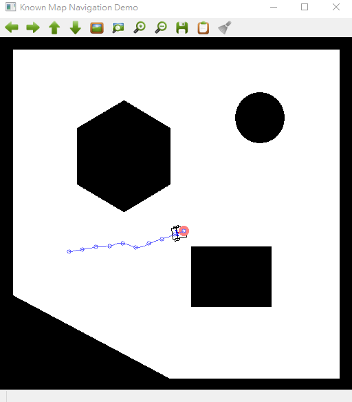

# HW1

<aside>
🗣 輸出的PDF會有跑板問題，請看線上版的文件: [https://lontoone.notion.site/HW1-a5f1afc2c9764571b2540b5fbefd0aad?pvs=4](https://www.notion.so/HW1-a5f1afc2c9764571b2540b5fbefd0aad?pvs=21)

</aside>

# Vehicle Model

### PID Basic Control

```csharp
import sys
import numpy as np 
sys.path.append("..")
import PathTracking.utils as utils
from PathTracking.controller import Controller

class ControllerPIDBasic(Controller):
    def __init__(self, kp=0.4, ki=0.0001, kd=0.5):
        self.path = None
        self.kp = kp
        self.ki = ki
        self.kd = kd
        self.acc_ep = 0
        self.last_ep = 0
    
    def set_path(self, path):
        super().set_path(path)
        self.acc_ep = 0
        self.last_ep = 0
    
    def feedback(self, info):
        # Check Path
        if self.path is None:
            print("No path !!")
            return None, None
        
        # Extract State
        x, y, dt = info["x"], info["y"], info["dt"]

        # Search Nesrest Target
        min_idx, min_dist = utils.search_nearest(self.path, (x,y))
        target = self.path[min_idx]
        
        # TODO: PID Control for Basic Kinematic Model        
        ang = np.arctan2(self.path[min_idx,1]-y, self.path[min_idx,0]-x)
        ep = min_dist * np.sin(ang)
        self.acc_ep += dt*ep
        diff_ep = (ep - self.last_ep) / dt
        next_w = self.kp*ep + self.ki*self.acc_ep + self.kd*diff_ep

        self.last_ep = ep
        return next_w, target

```

```csharp
python .\navigation.py -s basic -c pid -p rrt
```



### PID Differential Drive

```csharp
import numpy as np
import sys
sys.path.append("..")
from Simulation.utils import State, ControlState
from Simulation.kinematic import KinematicModel

class KinematicModelDifferentialDrive(KinematicModel):
    def __init__(self, r, l, dt):
        # Simulation delta time
        self.r = r
        self.l = l
        self.dt = dt
    
    def step(self, state:State, cstate:ControlState) -> State:
        x1dot = self.r*np.deg2rad(cstate.rw) / 2
        w1 = np.rad2deg(self.r*np.deg2rad(cstate.rw) / (2*self.l))
        x2dot = self.r*np.deg2rad(cstate.lw) / 2
        w2 = np.rad2deg(self.r*np.deg2rad(cstate.lw) / (2*self.l))
        v = x1dot + x2dot
        w = w1 - w2
        x = state.x + v * np.cos(np.deg2rad(state.yaw)) * self.dt
        y = state.y + v * np.sin(np.deg2rad(state.yaw)) * self.dt
        yaw = (state.yaw + w * self.dt) % 360
        state_next = State(x, y, yaw, v, w)
        print("state_next" , state_next)
        return state_next
```

```csharp
python .\navigation.py -s diff_drive -c pid -p rrt
```


### PID Bicycle

```csharp
import sys
import numpy as np 
sys.path.append("..")
import PathTracking.utils as utils
from PathTracking.controller import Controller

class ControllerPIDBicycle(Controller):
    def __init__(self, kp=0.4, ki=0.0001, kd=0.5):
        self.path = None
        self.kp = kp
        self.ki = ki
        self.kd = kd
        self.acc_ep = 0
        self.last_ep = 0
    
    def set_path(self, path):
        super().set_path(path)
        self.acc_ep = 0
        self.last_ep = 0
    
    def feedback(self, info):
        # Check Path
        if self.path is None:
            print("No path !!")
            return None, None
        
        # Extract State
        x, y, dt = info["x"], info["y"], info["dt"]

        # Search Nesrest Target
        min_idx, min_dist = utils.search_nearest(self.path, (x,y))
        target = self.path[min_idx]
        
        # TODO: PID Control for Bicycle Kinematic Model
        ang = np.arctan2(self.path[min_idx,1]-y, self.path[min_idx,0]-x)
        ep = min_dist * np.sin(ang) # distance to target
        self.acc_ep += dt*ep   # accumulate error
        diff_ep = (ep - self.last_ep) / dt   # change of error distance
        next_delta = self.kp*ep + self.ki*self.acc_ep + self.kd*diff_ep
        self.last_ep = ep
        return next_delta, target

```

```csharp
python .\navigation.py -s bicycle -c pid -p rrt
```


# Control Model

### Pure Pursuit Basic

```csharp
import sys
import numpy as np 
sys.path.append("..")
import PathTracking.utils as utils
from PathTracking.controller import Controller

class ControllerPurePursuitBasic(Controller):
    def __init__(self, kp=1, Lfc=10):
        self.path = None
        self.kp = kp
        self.Lfc = Lfc

    def feedback(self, info):
        # Check Path
        if self.path is None:
            print("No path !!")
            return None, None
        
        # Extract State 
        x, y, yaw, v = info["x"], info["y"], info["yaw"], info["v"]

        # Search Front Target
        min_idx, min_dist = utils.search_nearest(self.path, (x,y))
        Ld = self.kp*v + self.Lfc
        target_idx = min_idx
        for i in range(min_idx,len(self.path)-1):
            dist = np.sqrt((self.path[i+1,0]-x)**2 + (self.path[i+1,1]-y)**2)
            if dist > Ld:
                target_idx = i
                break
        target = self.path[target_idx]

        # TODO: Pure Pursuit Control for Basic Kinematic Model
                
        yaw_error = np.arctan2(self.path[target_idx,1]-y, self.path[target_idx,0]-x ) - np.deg2rad(yaw)       #- yaw  #np.deg2rad(yaw)      
        
        next_w =  (2*v *  np.sin(yaw_error)) / Ld         # 角速度
        next_w = np.rad2deg(next_w)         
        
        return next_w, target

```

```csharp
python .\navigation.py -s basic -c pure_pursuit -p rrt
```


### Pure Pursuit Differential Drive

```csharp
python .\navigation.py -s diff_drive -c pure_pursuit -p rrt
```


### Pure Pursuit Bicycle

```csharp
import sys
import numpy as np 
sys.path.append("..")
import PathTracking.utils as utils
from PathTracking.controller import Controller
def angle_norm(theta):
    return (theta + 180) % 360 - 180
class ControllerStanleyBicycle(Controller):
    def __init__(self, kp=0.5):
        self.path = None
        self.kp = kp

    # State: [x, y, yaw, delta, v, l]
    def feedback(self, info):
        # Check Path
        if self.path is None:
            print("No path !!")
            return None, None
        
        # Extract State 
        x, y, yaw, delta, v, l = info["x"], info["y"], info["yaw"], info["delta"], info["v"], info["l"]

        # Search Front Wheel Target
        front_x = x + l*np.cos(np.deg2rad(yaw))
        front_y = y + l*np.sin(np.deg2rad(yaw))
        vf = v / np.cos(np.deg2rad(delta))
        min_idx, min_dist = utils.search_nearest(self.path, (front_x,front_y))
        target = self.path[min_idx]

        # TODO: Stanley Control for Bicycle Kinematic Model
        if(min_idx ==0):
            min_idx = 1
        if(min_idx == len( self.path) -1 ):
            return 0 , target
        

        theta_p = np.arctan2( self.path[min_idx+1,1] - self.path[min_idx ,1] , self.path[min_idx+1,0]- self.path[min_idx,0] )
        ang =   np.deg2rad(yaw)
        theta_e = theta_p - ang

        e_xy = np.array([ x -  self.path[min_idx,0] , y - self.path[min_idx,1] ])
        
        e = np.matmul( 
                e_xy.reshape(1,-1)  , 
                np.array([np.cos(theta_p  +np.deg2rad(90) ) , np.sin(theta_p  +np.deg2rad(90) )] ).reshape(-1,1)
        )
        
        phi = np.arctan((-self.kp * e[0,0] )/ (vf+0.001 )) + theta_e
        next_delta = angle_norm(np.rad2deg(phi))

        return next_delta, target

```

```csharp
python .\navigation.py -s bicycle -c pure_pursuit -p rrt
```


# Path Planing

### A*


I plot the cost on the top of the point.

- code

```python
import cv2
import sys
sys.path.append("..")
import PathPlanning.utils as utils
from PathPlanning.planner import Planner
import numpy as np
'''
This class represents a node in the A* algorithm. 
Each node has coordinates (x, y), cost values (g, h, and total cost), 
a parent node, and a processed flag. The **set_parent** method updates 
the parent of a node and recalculates its cost if the new cost is lower.
'''
class AstarNode:
    def __init__(self , x, y , goal , start) :
        self.x = x 
        self.y = y
        #self.g =  start[0] - x + start[1]-y
        #self.h = goal[0] - x + goal[1]-y
        self.g = abs(start[0] - x + start[1]-y)
        self.h = abs(goal[0] - x + goal[1]-y)

        self.h_cost = 2
        self.cost = self.g + self.h *self.h_cost

        self.parent = None
        self.processed = False
        
    def set_parent(self , parent , goal , start):
        if self.parent is None:
            self.parent = parent
        else:
            new_g = abs(start[0] - self.x + start[1]-self.y)
            new_h = abs(goal[0] - self.x + goal[1]-self.y)
            new_cost = new_g + new_h * self.h_cost
            if( new_cost < self.cost):
                self.g = new_g 
                self.h = new_h * self.h_cost
                self.cost = new_cost
                self.parent = parent

    pass
'''
This class extends a base Planner class and implements the A* algorithm.
 It has methods for initialization (**initialize**), searching neighboring 
 nodes (**_search**), creating a distance map (**create_distance_map**), and 
 planning the path (**planning**). The **planning** method initializes the algorithm, 
 then iteratively searches the neighboring nodes of the current node until 
 the goal is reached or a maximum number of iterations is exceeded.
'''
class PlannerAStar(Planner):
    def __init__(self, m, img, inter=10 ):
        super().__init__(m)
        self.inter = inter
        self.initialize()
        self.img = img
    def _search(self , dx , dy, current  , start , goal ,img):
        idx_x =  int(current[0] +dx)
        idx_y =  int(current[1] +dy)
        #print("search " , (idx_x , idx_y))
        if( idx_y>= img.shape[0] or idx_x >= img.shape[1] or img[idx_y , idx_x , 0]== 0):
            return

        #if (self.nodes[(idx_x , idx_y)]  is None):
        if ((idx_x , idx_y) not in self.nodes ):
            new_node= AstarNode(idx_x , idx_y, goal , start)
            self.nodes[(idx_x , idx_y)]  = new_node
        else:
            new_node = self.nodes[(idx_x , idx_y)]

        self.nodes[(idx_x , idx_y)].set_parent(current , goal , start)
        if(not new_node.processed):
            self.open_nodes[(idx_x , idx_y)] =  self.nodes[(idx_x , idx_y)]
            new_node.processed =True

        

    def create_distance_map (self , size ,center):
        # size:  (y , x )

        #size = (600,525)
        #center = (100,200)

        x = np.abs( np.arange(size[1]) - center[1])
        y = np.abs( np.arange(size[0]) - center[0])
        z = np.array(np.meshgrid(x, y)).T

        return z # [x , y , 2 ]

        return 
	'''
Initialization: The method takes in a start point, a goal point,
 an interval (inter), and an image (img). If no interval is provided, 
 it uses the class’s default interval. It initializes the A* algorithm
  by setting the start point as the first node in the queue, setting
   its parent to None, and calculating its g and h costs.

	'''
    def initialize(self):
        self.queue = []
        self.parent = {}
        self.h = {} # Distance from start to node
        self.g = {} # Distance from node to goal
        self.goal_node = None

        self.step_width = 25 #pixel
        self.nodes = {}

        self.kernels = [
            [-1,1],
            [0,1],
            [1,1],

            [-1,0],
            [1,0],

            [-1,-1],
            [0,-1],
            [1,-1],

        ]

	'''
	*A Algorithm*: The method then enters a loop that runs until the goal 
	is reached or a maximum number of iterations (5000) is exceeded. 
	In each iteration, it checks all neighboring nodes (defined by the kernels)
	 of the current node. If a neighboring node is within the step width of
	  the goal, it sets the goal node and breaks the loop. Otherwise, it selects 
	  the next node with the lowest cost from the open nodes and continues the loop.
	'''
    def planning(self, start=(100,200), goal=(375,520), inter=None, img=None):
        if inter is None:
            inter = self.inter
        start = (int(start[0]), int(start[1]))
        goal = (int(goal[0]), int(goal[1]))
        # Initialize 
        self.initialize()
        self.queue.append(start)
        self.parent[start] = None
        self.g[start] = 0
        self.h[start] = utils.distance(start, goal)
        self.open_nodes ={}
        
        is_reached = False
        debug_itr = 0
        #while(1):
        while(debug_itr < 5000):
            # TODO: A Star Algorithm           

            # update
            if(len(self.nodes) ==0):
                current_point  = start
            

            for k in self.kernels:
                search_idx =  ( current_point[0] + k[0] * self.step_width ,current_point[1] + k[1] * self.step_width ) 
                self._search(k[0] * self.step_width , k[1]* self.step_width , current_point , start , goal , self.img )
                
                if (utils.distance( search_idx , goal) < self.step_width):
                    is_reached = True
                    self.nodes[goal] = AstarNode(goal[0] , goal[1], goal , start)
                    self.nodes[goal].set_parent(  ( current_point[0] , current_point[1]) , start,goal  )

            if(is_reached):
                break
            # sort 
            next_point = sorted(self.open_nodes.values(), key=lambda x: x.cost)[0]            
            current_point = (next_point.x , next_point.y)
            del self.open_nodes[current_point]
            
            debug_itr +=1

        for p in self.nodes:
            print(p)
            img = cv2.circle(img , p , 2 , (255,0,0), -1) 
            img = cv2.putText(img, str(self.nodes[p].cost), p, cv2.FONT_HERSHEY_COMPLEX_SMALL , .55, (0,255,0), 1, cv2.LINE_AA)
            
            
        path = []  # output
        path_idx = goal
        path.append(path_idx)
        while(path_idx != start):
            path_idx = self.nodes[path_idx].parent
            path.append(path_idx)
        path = path[::-1]
      
        return path

```

```csharp
python .\navigation.py -s diff_drive -c pure_pursuit -p a_star
```


### RRT*

```python
import cv2
import numpy as np
import sys
sys.path.append("..")
import PathPlanning.utils as utils
from PathPlanning.planner import Planner
'''
 It has methods for generating a random node (**_random_node**), 
 finding the nearest node in the tree to a given node (**_nearest_node**),
  checking if a path between two nodes is collision-free (**_check_collision**),
   and steering from one node towards another (**_steer**).
'''
class PlannerRRTStar(Planner):
    def __init__(self, m, extend_len=20 , img =None):
        super().__init__(m)
        self.extend_len = extend_len 
        self.img = img
'''
This method generates a random node. With a 50% probability, 
it returns the goal node; otherwise, it returns a node with 
random coordinates within the map.
'''
    def _random_node(self, goal, shape):
        r = np.random.choice(2,1,p=[0.5,0.5])
        if r==1:
            return (float(goal[0]), float(goal[1]))
        else:
            rx = float(np.random.randint(int(shape[1])))
            ry = float(np.random.randint(int(shape[0])))
            return (rx, ry)
		'''
		This method finds the node in the tree that is closest to a given sample node.
		'''
    def _nearest_node(self, samp_node):
        min_dist = 99999
        min_node = None
        for n in self.ntree:
            dist = utils.distance(n, samp_node)
            if dist < min_dist:
                min_dist = dist
                min_node = n
        return min_node
	'''
	This method checks if the straight line path between two nodes is 
	collision-free. It uses the Bresenham’s line algorithm to get the
	 pixels on the line and checks if any of these pixels are obstacles.
	'''
    def _check_collision(self, n1, n2):
        n1_ = utils.pos_int(n1)
        n2_ = utils.pos_int(n2)
        line = utils.Bresenham(n1_[0], n2_[0], n1_[1], n2_[1])
        for pts in line:
            if self.map[int(pts[1]),int(pts[0])]<0.5:
                return True
        return False
		'''
		This method steers from one node towards another node. 
		It calculates the vector from the **from_node** to the **to_node**, 
		then creates a new node in the direction of this vector with
		 a distance of **extend_len** from the **from_node**. If the new node
		  is outside the map or collides with an obstacle, it returns 
		  False; otherwise, it returns the new node and the distance to it.
		'''
    def _steer(self, from_node, to_node, extend_len):
        vect = np.array(to_node) - np.array(from_node)
        v_len = np.hypot(vect[0], vect[1])
        v_theta = np.arctan2(vect[1], vect[0])
        if extend_len > v_len:
            extend_len = v_len
        new_node = (from_node[0]+extend_len*np.cos(v_theta), from_node[1]+extend_len*np.sin(v_theta))
        if new_node[1]<0 or new_node[1]>=self.map.shape[0] or new_node[0]<0 or new_node[0]>=self.map.shape[1] or self._check_collision(from_node, new_node):
            return False, None
        else:        
            return new_node, utils.distance(new_node, from_node)
    
		'''
		This method implements the main loop of the RRT* algorithm. 
		It initializes the tree with the start node, then iteratively
		 adds new nodes to the tree by steering towards randomly sampled
		  nodes. If a new node is close enough to the goal, it sets the 
		  goal node and breaks the loop. It also includes a placeholder 
		  for the re-parenting and re-wiring step of the RRT* algorithm,
		   which is used to optimize the path.
		'''
    def planning(self, start, goal, extend_len=None, img=None):
        if extend_len is None:
            extend_len = self.extend_len
        self.ntree = {}
        self.ntree[start] = None
        self.cost = {}
        self.cost[start] = 0
        goal_node = None
        for it in range(20000):
            #print("\r", it, len(self.ntree), end="")
            samp_node = self._random_node(goal, self.map.shape)
            near_node = self._nearest_node(samp_node)
            new_node, cost = self._steer(near_node, samp_node, extend_len)
            if new_node is not False:
                self.ntree[new_node] = near_node
                self.cost[new_node] = cost + self.cost[near_node]
            else:
                continue
            if utils.distance(near_node, goal) < extend_len:
                goal_node = near_node
                break
                
            # TODO: Re-Parent & Re-Wire
            nearst_parent = sorted(self.ntree.values(), key=lambda x: self.cost[x]  if x is not None and utils.distance(x ,new_node ) < 100  else 9999)[0]
            # Re-Parent & Re-Wire
            self.ntree[new_node] = nearst_parent
            self.cost[new_node] = cost + self.cost[nearst_parent]

            # Draw
            '''
            if img is not None:
                for n in self.ntree:
                    if self.ntree[n] is None:
                        continue
                    node = self.ntree[n]
                    cv2.line(img, (int(n[0]), int(n[1])), (int(node[0]), int(node[1])), (0,1,0), 1)
                # Near Node
                img_ = img.copy()
                cv2.circle(img_,utils.pos_int(new_node),5,(0,0.5,1),3)
                # Draw Image
                img_ = cv2.flip(img_,0)
                cv2.imshow("Path Planning",img_)
                k = cv2.waitKey(1)
                if k == 27:
                    break
            '''
        
        # Extract Path
        path = []
        n = goal_node
        while(True):
            if n is None:
                break
            path.insert(0,n)
            node = self.ntree[n]
            n = self.ntree[n] 
        path.append(goal)
        return path

```

```csharp
python .\navigation.py -s diff_drive -c pure_pursuit -p rrt_star
```


# Collision Handling

When a collision occurs, the car is pushed back and the path is reset.


```python
if info["collision"]:
            collision_count = 1
            _collision_pos = (simulator.state.x , simulator.state.y)

        if collision_count > 0 and  _collision_pos is not None:
            # TODO: Collision Handling        
       
            collision_distance = np.sqrt((simulator.state.x - _collision_pos[0])**2 +(simulator.state.y - _collision_pos[1])**2) 
            
            if(collision_distance  < 15):
                # if still in collision range
                backup_command = ControlState(args.simulator, -1, 0)
                simulator.step(backup_command)
            else:
                _collision_pos = None
                collision_count = 0
                pass
            pass
```

---

- Github: https://github.com/Lontoone/NTHU_11202_Car_hw1